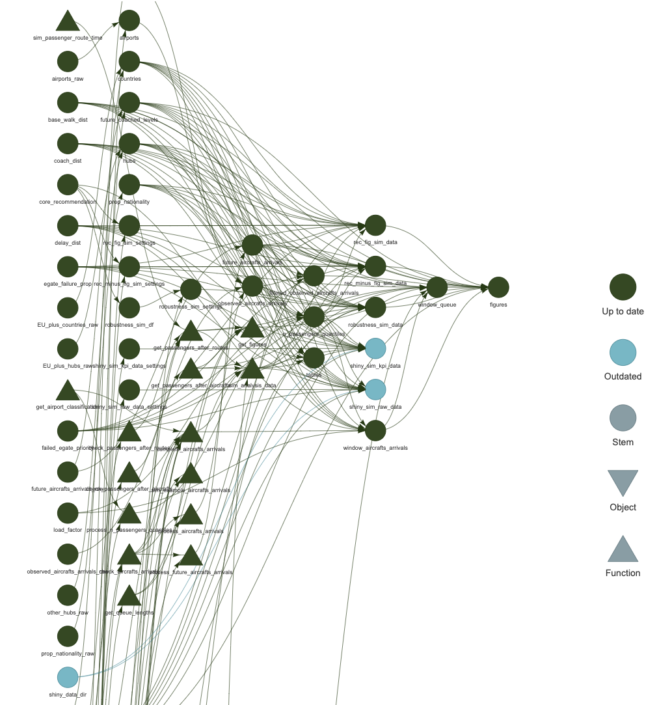
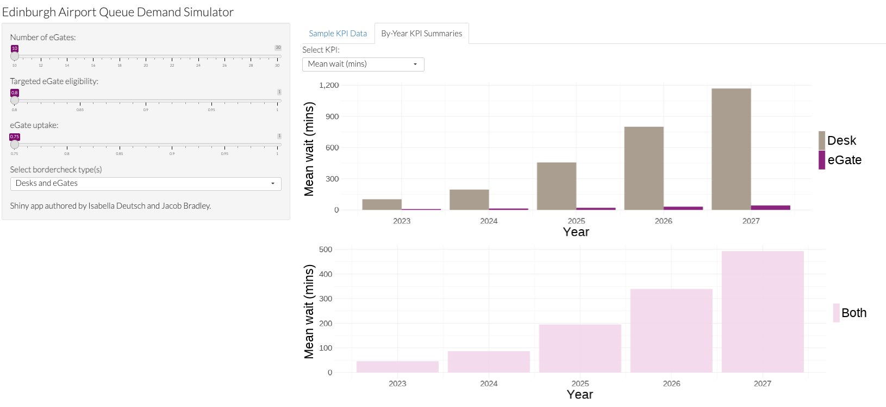

# Simulations of Immigration Queues at Edinburgh Airport
This repository contains the data, code, and report for Jacob Bradley and Isabella Deutsch's submission to the SIAM UKIE Student Chapter 2023 Modelling Competition. If this has been made public (it won't while the competition is running -- or potentially ever) or you've been added as a collaborator, that means you're welcome to share, use, and adapt it!

## Repository overview
This repository contains:
 * The code used to perform the analyses presented in our written reports.
 * Results of this analysis, e.g. figures, tables.
 * LaTeX code to generate each of our reports.
 * Code to produce the Shiny app available as part of our contribution.

## Raw data
This repository has been designed to enable maximum transparency of code and analysis, while preventing the public sharing of private data. We have therefore excluded our `raw_data` folder (this is also helpful in keeping the repo size acceptably small). This consists of unedited raw files provided by the modelling competition and external sources. Readers may therefore see (with the help of the `targets` framework -- see below) exactly how this data was used. This folder is also available, upon reasonable request.

## Targets
Throughout this project we've used the `targets` framework for workflow management. This is available as an R package, and can be used to visualise the dependency structure between all code and objects in our analysis. A dependency graph can be produced with the R command 

```
targets::tar_visnetwork(targets_only = TRUE)
```
We show below an example of a recent run of this command (for a recent almost-complete point in the project). 


`targets` also allows for concise reproduction of all results (note that to do so, one needs access to the `raw_data` folder). We would recommend running 

```
targets::tar_make('figures')
targets::tar_make('tables')
```

The first operation will take some time, since all simulations need to be run. Note that running the second line will take no time, since these simulations have already been produced!

## Shiny
We provide a bespoke Shiny Application for interactive exploration of our analyses. The code for this is provided in the `shiny` folder. Users can deploy the Shiny App locally with the command
```
source("shiny/demo_shiny_app.R")
```
This should produce an output like the one below (after a login prompt):


Note that, as with `raw_data`, there's too much data underpinning the Shiny App to provide here. There are two options for dealing with this:

 * Running `targets::tar_make()`. Beware: this will take some time (maybe one to be run overnight).
 * Asking us, and we'll send you a pre-computed data folder.

The Shiny App is also of course available through its online interface. See our report for login credentials.
